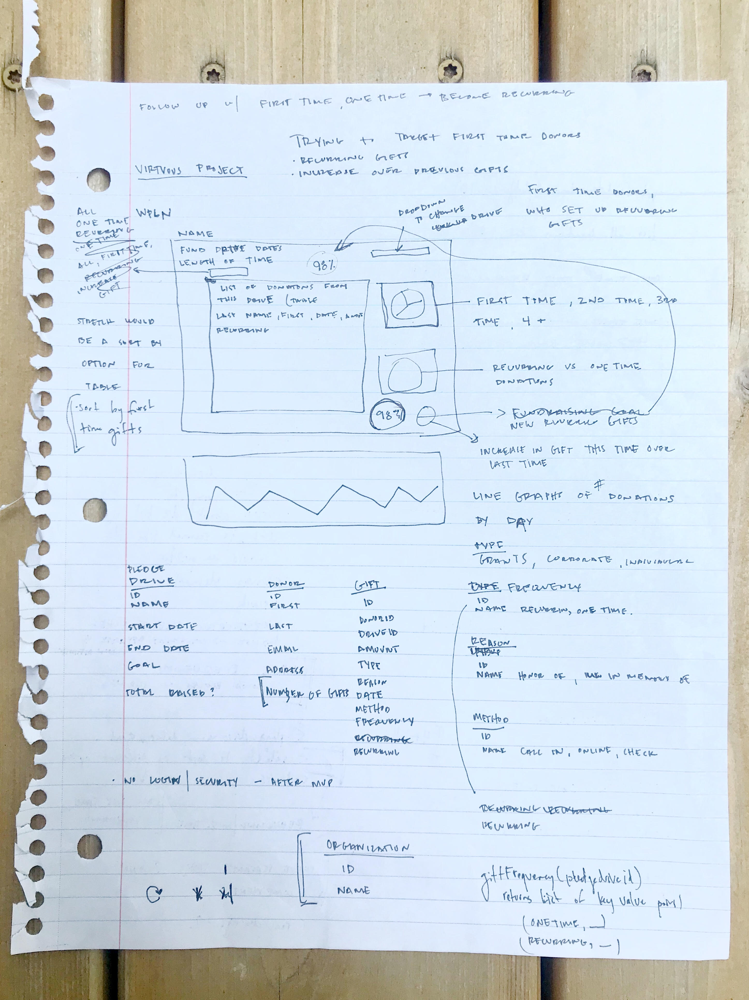
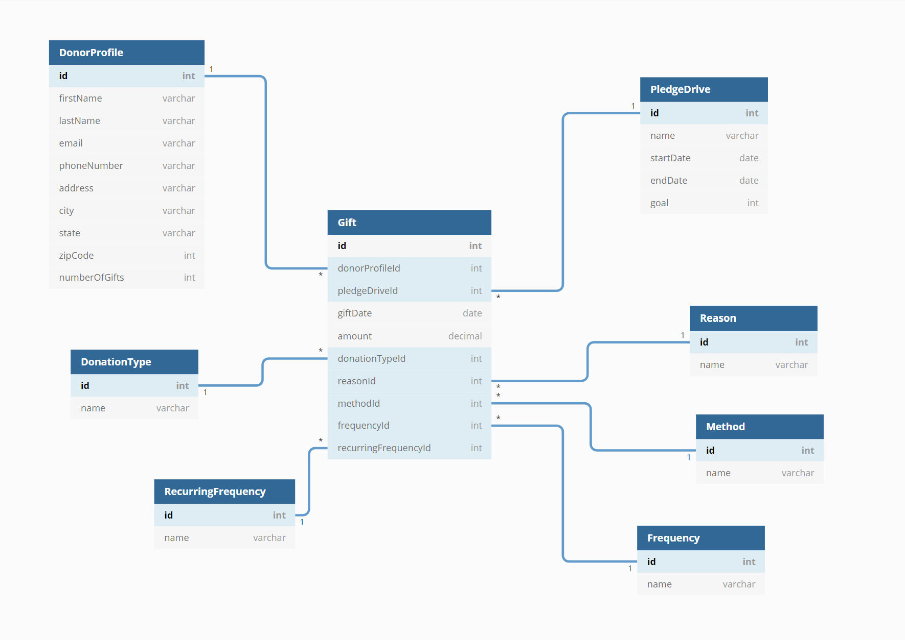

# NPRDashboard

---
Of Note: This project was developed as a technical project during the recruiting process and was not solicited by NPR or WPLN.

**_The Pledge Drive Dashboard_** is an app developed to help track pledge drive gifts and provide a couple quick visual representations of pledge drive specific data. 

## Background
Nashville’s local NPR station - WPLN - wants a better way to track and visualize data from their pledge drives. The team has an overall monetary goal, but they’re also trying to hone in on a few metrics that they think could be beneficial to track for future pledge drives and to use when following up with donors. 

#### Metrics To Track
- The number of donors grouped by the number of gifts to date (ie. 36 donors have given 4 gifts each to date) 
- New sustaining memberships from previous donors (ie. 5 previous donors pledged a new sustaining membership rather than a one time gift)
- Number of gift increases in a one time gift over the donors previous gift amount (ie. 10 donors increased their one time gift amount over their previous one time gift amount)

The WPLN staff has asked you to create a desktop dashboard so they can easily see these metrics specific to each drive. 

## Project Goal
Build a dashboard that tracks the requested metrics. 

### MVP Requirements
- User can select a specific pledge drive 
- User can see gifts organized and displayed by chosen pledge drive
- User can sort gifts by gift Frequency
- User can see visual display of gifts by Frequency
- User can see number of donors by number of lifetime gifts to date
- User can see number of new sustaining memberships from previous donors
- User can see number of previous donors who have increased their one time gift amount

### Learning Goals
- Quickly research, design, and create a new project
- Creating charts
- Using SQL subqueries 

### Technology used

#### Front-end

-   React
-   Reactstrap
-   Custom CSS

#### Back-end

-   C#
-   .NET 5
-   ASP.NET Core
-   SQL Server

#### Design and Development

-   DbDiagram.io
---

## Planning Documentation

### Concept Sketch 
</img>

### Entity Relationship Diagram
</img>
---

## Try It Out

Instructions for running the dashboard.

### Requirements

-   Git
-   Visual Studio (configured to run server-side ASP.NET Web API C# code)
-   MS SQL Server (Express or higher)
-   NodeJS

### Clone the project

From a terminal window, in any directory you'd like, run: `git clone git@github.com:kohinrichs/NPRDashboard.git`

### Back-end setup

-   From `NPRDashboard/SQL`, run the scripts `01_Db_Create.sql` and then `02_Seed_Data.sql` to generate the database.
-   Load `NPRDashboard.sln` in Visual Studio and hit F5 to run the server (after ensuring that NPRDashboard is selected instead of the default IIS Express server)

### Front-end Setup

-   Run `npm install` in `NPRDashboard/client` to install all dependencies
-   To start the development server on `localhost:3000`, run `npm start`
-   A browser window will open with the dashboard initial view.
